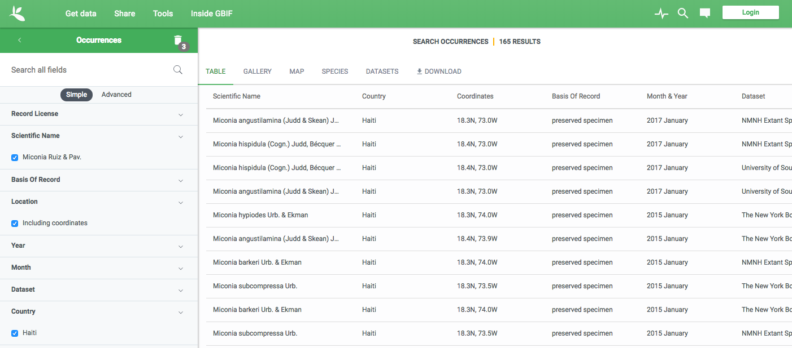
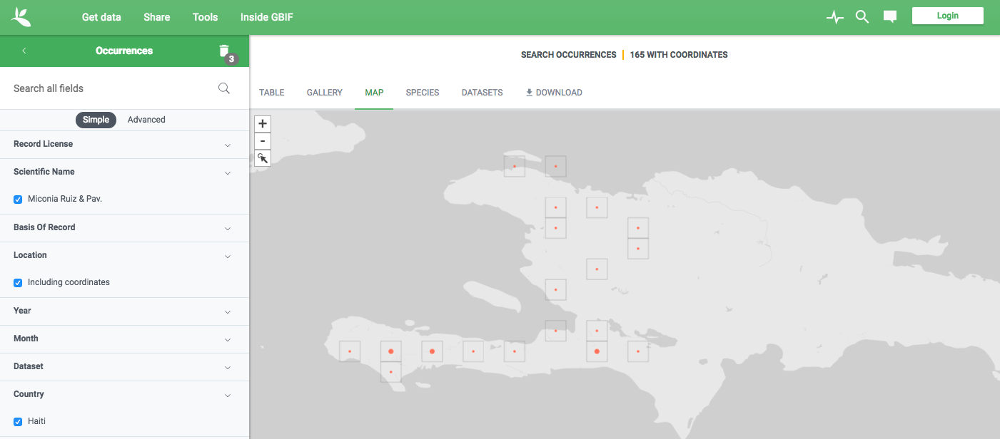
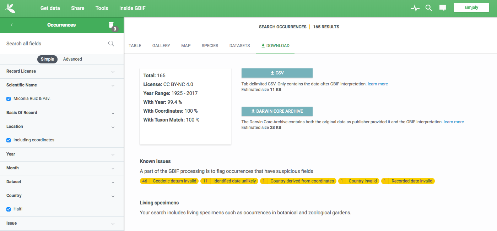
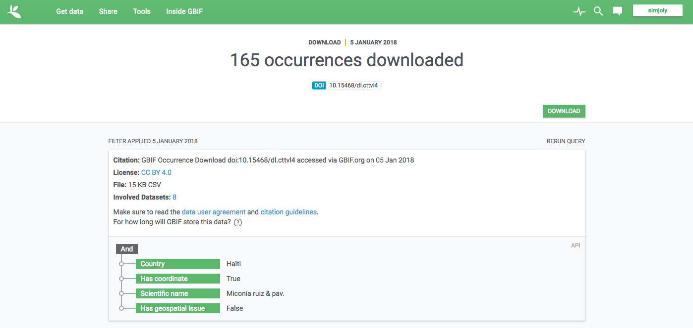

# Preface

Le but de cette atelier est de donner une introduction à certains types d'analyses qui peuvent être effectuées à l'aide de données d'occurence de biodiversité. Il contient des exercises dans le logiciel R. Bien que le logiciel est un peu complexe d'utilisation, les avantages à l'utiliser compensent largement. En effet, une fois que les rudiments de R sont maîtrisés, il est possible d'effectuer une panoplie d'analyses, et même d'en développer selon ses propres besois.

l'atelier est préparé pour des personnes qui ont des connaissance minimales avec le logiciel R. Cependant, ce n'est pas une introduction au language R et à son utilisation. Les principles de bases seront expliqués, mais nous n'iront pas en profondeur. Les intéressés pourront se référer à d'autres tutoriels plus poussés sur le sujet.

## Autres ressources pour R

[QCBS workshop](http://qcbs.ca/wiki/r_workshop4) -- Il s'agit d'un regroupement de tutoriels qui sont très bien expliqués. C'est une bonne introduction au logiciel R et aux analyses qu'il est possible d'utiliser dans R.

[Dismo package]() -- C'est le package que l'on utilisera beaucoup dans ce tutoriel. Le manuel du package est plein d'informations utiles sur les données de biodiversité et donne une bonne idées des analyses qui sont possible d'effectuer.


# Récupérer des données de biodiversité

C'est généralement la première étape à effectuer. On peut soit avoir nos propres données, ou soit les télécherger d'une base de données publique. On va utiliser un exemple ici avec le Global Biodiversity Information Facility (GBIF).

Tout d'abord, aller sur le site de [GBIF](https://www.gbif.org/) au www.gbif.org.

Cliquer sur "occurences" juste en haut de la barre de recherche sur la page. Vous allez vous retrouver sur la page de recherche des occurences.

Tapez ensuite "Miconia", qui est un genre de plante très commun à Haïti. On vous demandera si vous cherchiez bien le nom de ce genre; cliquez sur "oui".

Sous l'onglet "pays" à la gauche de l'écran, rechercher Haïti. Vous allez ainsi avoir toutes les occurences du genre Miconia dans GBIF qui proviennent d'Haïti. Dans l'onglet occurences, vous pouvez ensuite sélectionner seulement les occurences qui ont des coordonnées géographiques de type latitude / longitude. Vous remarquerez que ça limite grandement le nombre de spéciments, qui chute de plus de 900 à moins de 200 (données de janvier 2018). C'est important parce que les analyses que nous allons effectuer nécessitent des coordonnées géographiques précises. 

Par défaut, vous avez une vision en tableau des données, comme ici:



Mais il est possible aussi de preprésenter ces spécimens sur une carte en cliquant sur "map":



Cela donne une idée de la provenance géographique des spécimens.

Maintenant, il faut télécharger les spécimens. Pour ce faire, il faut cliquer sur "download". Pour télécharger les spécimens, il faut se créer un compte sur GBIF, ce qui est gratuit. Pour cette activité, pas besoin de vous créer un compte parce que je vais fournir de jeu de données pour l'activité. Lors que vous vous êtes identifiés, vous obtiendrai des informations importantes sur le jeu de données. Vous pouvez ensuite télécharger les données en format CSV ou DarwinCore (qui contient plus d'information). Pour l'activité, nous allons simplement télécharger le format CSV.



Lorsque les données seront prêtes à être téléchargées, GBIF va vous donner un numéro de doi (Digital Object Identifier) pour le jeu de données. Il est important de le prendre en note. Ceci permet de citer les données de GBIF adéquatement lors d'une publication, par exemple, et de s'assurer que quelqu'un d'autre pourrait reproduire nos analyses.



Cliquez ensuite sur "download" pour compléter le téléchargement. Le fichier à souvent un nom complexe que vous pouvez renommer. 


# Introdution à R


## Installer R et Rstudio

Avant de commencer les exercices, il est nécessaire d'installer le logiciel R. Le logiciel peut être téléchargé à partir du site web https://cran.rstudio.com/.

Je vous suggère aussi de télécharger Rstudio. Rstudio est un logiciel graphique qui permet d'intéragir de façon plus conviviale avec R. Vous pouvez le télécharger à partir du site web https://www.rstudio.com/products/rstudio/download/. La version gratuite est amplement suffisante et vous pouvez télécharger la version qui correspond à votre plateforme.


## Obtenir le matériel pour l'atelier

Le matériel de l'atelier est hébergé sur le site de partage github. La meilleure façon pour pouvoir faire l'atelier est d'aller sur la page de l'atelier et de télécharger le dossier sur votre ordinateur. Voici la page de l'atelier: [Atelier sur la biodiversité](http://www.github.com/simjoly/BiodiversityWorkshop-Haiti2018).

Une fois le dossier téléchargé et décompressé, vous pouvez ouvrir R studio et choisir ce dossier comme "working directory". Pour ce faire, allez dans le menu "Session > Set Working Directory > Choose Directory".


## Installer les paquets nécessaires

R vient avec des fonction de base qui sont fréquemment utilisées. Cependant, si vous voulez utiliser des fonction avancées ou très spécifiques, il faut généralement installer des "packages" écrit par différents auteurs. Par exemple, le package `dismo` est très utile pour travailler avec les données d'occurence. Il faut donc l'installer. Pour l'installer, il faut taper la commande suivante dans Rstudio:

```{r, eval=FALSE}
install.packages('dismo')
```

Si on veut installer un autre package, on peut remplace `dismo` par le nom de l'autre package. Il est seulement nécessaire d'installer ces packages une fois.

> Pour les prochains exercices, il vous sera possible de simplement copier les commandes qui se trouvent dans les blocs de commande et de les coller dans la console de RStudio.

Voici la commande pour installer tous les packages qui seront nécessaires pour l'atelier. Vous remarquerez que certains autres packages seront automatiquement installés lors de l'installation puisqu'ils sont requis pour utiliser les packages qui nous intéressent.

```{r, eval=FALSE}
install.packages('dismo','maptools','rgeos','rJava','plyr')
```


# Carte des occurences

Dans cette section, nous allons voir comment obtenir une carte des occurences.


## Lire les données

Nous devons d'abord charger dans R les packages que nous avons installés plus tôt. Ceci se fait avec la fonction `library()`, ce qui permet ensuite d'utiliser les fonction du package.

```{r "Installation deffectueuse", eval=FALSE, echo=FALSE}
If installation f rJava doesn't work, install it from the shell, and then:
sudo ln -f -s $(/usr/libexec/java_home)/jre/lib/server/libjvm.dylib /usr/local/lib
```

```{r, "load libraries", warning=FALSE, error=FALSE, message=FALSE}
library(dismo)
library(maptools)
library(rJava)
library(rgeos)
```

La première étape est de lire les données dans R. Surprenamment, c'est souvent l'étape la plus difficile. Les commandes du bloc suivant vont lire les données du fichier csv et les sauver dans un objet de type data.frame. La commande `head()` permet d'avoir un apperçu des premières lignes du tableau, ce qui permet de voir si l'importation a fonctionné.

> Notez que dans le language R, tout ce qui suit le symbole '#' sur une ligne est considéré comme un commentaire et n'est pas interprété par le programme. C'est utile pour mettre des notes dans le code.

```{r}
# Lire les doonées et les mettre dans un data frame
miconia_occurences <- read.delim("./data/Miconia.csv",h=T,dec=".")
head(miconia_occurences)
```

On peut voir que le fichie contient beaucoup d'information (taxonomie, géographie, localité, lat-long, collection d'origine, etc.).

Comme il y a beaucoup d'information qui ne nous intéresse pas, on va filtrer les données pour seulement conserver les information d'intérêt. On peut faire ceci avec la fonction subset.

```{r,"Sélectionner les variables importantes"}
# Sélectionner les variables importantes
miconia_gbif <- subset(miconia_occurences, select = c(species, decimallongitude, decimallatitude))
head(miconia_gbif)
```

Comme vous pouvez voir, l'option `select` permet de choisir les variables que l'on veut conserver.

> Dans R, il est toujours possible d'obtenir de l'information sur une fonction en tapant un point d'interrogation suivit du nom de la fonction. Par exemple, `?subset`


## Faire une carte des occurences

La première chose à faire pour pouvoir représenter les occurences, c'est de représenter une carte géographique. Il existe beaucoup de façon de faire cela dans R. Ici, on va utiliser une carte vectorielle des Caraïbes qui est disponible avec les données de l'atelier. On va la lire en utilisant la fonction `readShapeSpatial()`.

```{r "Caribbean map", warning=FALSE}
# Charger une carte des Caraïbes
caribbean <- readShapeSpatial("./data/pol6bg/pol6bg.shp")
```

On peut maintenant la représenter avec la fonction `plot()`

```{r "Plot Caribbean map", fig.align='center'}
# Charger une carte des Caraïbes
plot(caribbean)
```

Il est cependant possible de mieux contrôler l'aperçu de la carte à l'aide d'options. Par exemple, on peut représenter seulement une partie de celle-ci en donnant les coordonnées minimales et maximales à représenter avec les option `xlim` et `ylim`. Voici un exemple:

```{r "Nicer map", fig.align='center'}
plot(caribbean, xlim=c(-75,-70), ylim=c(17,21), axes=TRUE, col="light yellow", cex.axis=0.8, tcl=-0.2, mgp=c(3,0.5,0))
```

Maintenant que l'on a cette carte, on peut facilement ajouter les points d'occurence avec la fonction `points()`. La fonction `points()` requiert les latitudes et longitudes de chaque point. Voici l'ensemble des commandes nécessaires:

```{r "Nicer map with points", fig.align='center'}
# Représenter la carte géographique
plot(caribbean, xlim=c(-75,-70), ylim=c(17,21), axes=TRUE, col="light yellow", cex.axis=0.8, tcl=-0.2, mgp=c(3,0.5,0))
# Ajouter les points d'occurence
points(x=miconia_gbif$decimallongitude, y=miconia_gbif$decimallatitude, pch=21, col="gray10", bg="blue")
```

Pour la commande `points()`, l'option `pch` contrôle le type de forme, `col` la couleur du contour de la forme et `bg` la couleur d'arrière-plan de la forme. De plus, la formulation `miconia_gbif$decimallongitude` indique que l'on veut la variable `decimallongitude` du data frame `miconia_gbif`.

Cette carte représente l'ensemble des collections du genre Miconia possédant des coordonnées géographiques sur le serveur GBIF.


### Carte montrants plusieurs espèces

Il pourrait être intéressant de montrer les différentes espèces, par exemple en donnan une couleur différente à chaque espèce. Une telle carte demande un peu plus d'étapes à faire, mais ce n'est pas très compliqué.

Il faut tout d'abord créer une liste de toutes les espèces présentes dans les données.

```{r "liste d'espèces"}
miconia_sp <- unique(miconia_gbif$species)
# L'objet miconia_sp est un vecteur contenant toutes les espèces
# qui étaient présentes dans le jeu de données. On peut calculer le 
# nombre total d'espèces dans le jeu de données en calculant la 
# taille de ce vecteur de la façon suivante:
length(miconia_sp)
```

Comme vous pouvez voir, il y a un total de 40 espèces de Miconia pour lesquelles on a des données d'occurence à Haïti.

Maintenant, on veut créer un vecteur de couleur pour associer chaque espèces à une couleur différente. Ceci peut être fait avec la fonction .


### Carte avec une seule espèce

De façon similaire, il peut être intéressant de faire une carte pour une seule espèce. Ceci est plus simple. Il s'agit de faire une nouvelle base de données, mais contenant les informations d'une seule espèce.

```{r "Carte avec Miconia subcompressa", fig.align='center'}
# Faire un objet contenant seulement les donnes de l'espèce Miconia subcompressa
Msubcompressa_gbif <- subset(miconia_gbif,species=="Miconia subcompressa")
# Faire une carte pour cette espèce
plot(caribbean, xlim=c(-75,-70), ylim=c(17,21), axes=TRUE, col="light yellow", cex.axis=0.8, tcl=-0.2, mgp=c(3,0.5,0))
points(x=Msubcompressa_gbif$decimallongitude, y=Msubcompressa_gbif$decimallatitude, pch=21, col="gray10", bg="blue")
# Ajouter un titre
title("Occurences de Miconia subcompressa")
```


## Challenge 1

En vous inspirant de l'exemple ci-dessus, essayez de faire une carte d'occurence pour l'expèce Miconia tetrastoma.

Ensuite, si vous avez le temps, testez différents types de points, par exemple en utilisant `pch=22` dans la fonction `points`.

```{r "Carte avec Miconia tetrastoma", eval=FALSE, echo=FALSE}
# Faire un objet contenant seulement les donnes de l'espèce Miconia tetrastoma
Mtetrastoma_gbif <- subset(miconia_gbif,species=="Miconia tetrastoma")
# Faire une carte pour cette espèce
plot(caribbean, xlim=c(-75,-70), ylim=c(17,21), axes=TRUE, col="light yellow", cex.axis=0.8, tcl=-0.2, mgp=c(3,0.5,0))
points(x=Mtetrastoma_gbif$decimallongitude, y=Mtetrastoma_gbif$decimallatitude, pch=22, col="gray10", bg="blue")
# Ajouter un titre
title("Occurences de Miconia tetrastoma")
```


# Carte de biodiversité

Dans cette section, nous allons voir comment faire une carte de biodiversité, c'est à dire de diviser la carte en carrés et calculer la diversité en espèce pour chaque carré.

Pour simplifier le processus, les commandes plus complexe ont été regroupées dans une fonction. Dans R, on peut créer facilement une fonction que l'on peut réutiliser pas la suite. Ici, l'idée est de créer une carte quadrillée (un raster) où l'on va calculer le nombre d'espèce observé pour chaque cellule. Voici la fonction biodivmap.

```{r "biodivmap"}
# Fonction biodivmap
biodivmap <- function(data, xdiv=15, ydiv=15, xmin=-75, xmax=-70, ymin=17, ymax=21){
  # Vecteur d'espèces
  sp <- unique(data[,1])
  # Créer un raster vide avec des valeurs de 0
  map <- raster(xmn=xmin, xmx=xmax, ymn=ymin, ymx=ymax, ncols=xdiv, nrows=ydiv)
  map <- setValues(map, 0)
  # Calculer le nombre d'espèces dans chaque rectangle
  for (i in 1:length(sp)){
    temp <- data[data[,1]==sp[i],c(2,3)]
    cell_numbers <- cellFromXY(map,temp)
    cell_numbers <- na.omit(cell_numbers)
    cell_numbers <- unique(cell_numbers)
    map[cell_numbers] <- map[cell_numbers] + 1
  }
  return(map)
}
```

Pour appliquer cette fonction, on fait comme avec nimporte quelle autre fonction.

```{r, fig.align='center'}
# Préparer la carte à l'aide de la fonction 'biodivmap'
map <- biodivmap(miconia_gbif, xdiv=15, ydiv=15, xmin=-75, xmax=-70, ymin=17, ymax=21)

# Créer un gradient de couleur pour représenter le gradient de diversité
colorPalette <- colorRampPalette(c("grey90","#7570b3","#d95f02"))(50)
colorPalette <- c(NA,colorPalette)
# Le NA dans R est pour les données absentes. On l'ajoute ici pour qu'il y ait 
# 'absence' de couleur quand il n'y a pas de données de biodiversité.

# Créer la carte de diversité
plot(map, col=colorPalette,main="Nombre d'espèces de plantes", cex.axis=0.8, tcl=-0.2, mgp=c(3,0.5,0))
plot(caribbean, col=NA,add=TRUE)
```

On obtient donc une carte ou la couleur de chaque carré correspond à un nombre d'espèces donné. On remarque que ces la région du Massif de la Hotte qui possède le plus d'espèces observées.

Il serait possible de faire une carte avec une pllus fine résolution en demandant à la fonction plus de divisions en x et en y.

```{r, fig.align='center'}
# Préparer une 2e carte à l'aide de la fonction 'biodivmap'
map2 <- biodivmap(miconia_gbif, xdiv=30, ydiv=30, xmin=-75, xmax=-70, ymin=17, ymax=21)
# Créer la carte de diversité
plot(map2, col=colorPalette,main="Nombre d'espèces de plantes", cex.axis=0.8, tcl=-0.2, mgp=c(3,0.5,0))
plot(caribbean, col=NA,add=TRUE)
```

On voit que la résolution est plus fine. Cependant, comme il y a peu de données, ça fait plusieurs trous dans la carte de diversité.


## Challenge 2

Pour le défi #2, je vais vous demander de créer une carte de diversité, mais pour toutes les espèces de plantes présentes sur GBIF. Pour ce faire, il faut d'abord importer ces données.

```{r}
load(file="./data/plantes_haiti_gbif.Rdata")
```

L'objet contenant les données s'appelle `plantes_haiti_gbif`. Ce sont des données téléchargées en septembre 2017. Vous pouvez y jeter un coup d'oeil.

```{r}
head(plantes_haiti_gbif)
```

Le tableau contient les espèces dans la première colonne, suivi de la longitude et de la latitude, comme précédemment. Donc, vous pourrez utiliser la fonction de la même façon. Maintenant, tentez de créer une carte de biodiversité de toutes les espèces de plantes. Qu'est-ce que vous pouvez conclure de cette carte?

```{r "challenge 2", echo=FALSE, eval=FALSE, fig.align='center'}
map3 <- biodivmap(plantes_haiti_gbif, xdiv=20, ydiv=20, xmin=-75, xmax=-70, ymin=17, ymax=21)
# Créer la carte de diversité
plot(map3, col=colorPalette,main="Nombre d'espèces de plantes", cex.axis=0.8, tcl=-0.2, mgp=c(3,0.5,0))
plot(caribbean, col=NA,add=TRUE)

```


# Extraire des informations de cartes

## Données bioclimatiques

Un des avantages des occurences avec coordonnées géographiques est que l'on peut obtenir beaucoup plus d'informations de ces données. Par exemple, si on possède des cartes qui contiennent des informations environnementales pour le territoire d'intérêt, il est possible d'en apprendre sur les conditions dans lesquelles vivent les espèces.

Ces cartes sont parfois difficiles à obtenir pour certaines variables (variables des sols par exemple). Cependant, d'autres sont facile à obtenir. C'est le cas de données climatiques comme la température et les précipitations. La base de données [WorldClim](http://www.worldclim.org/version1) met à la disposition des chercheurs des données bioclimatiques, c'est à dire des informations sur la température et les précipitations qui sont potentiellement importantes pour les espèces de plantes et d'animaux. Il suffit de télécharger ces cartes sur notre ordinateur et de les placer dans notre répertoire de travail pour les utiliser.

Comme les fichiers sont très gros, j'ai déjà préparé un objet contenant les données bioclimatiques pour l'île d'Hispaniola. Afin d'obtenir cet objet, il faut charger le fichier de données appelé "bioclim_data.Rdata" de la façon suivante.

```{r, eval=FALSE, echo=FALSE}
library('rgdal')
files <- list.files(path="/Users/simjoly/Dropbox/Projet Niches Pollinisateurs/analyses/data/bioclim/",pattern="asc$",full.names=TRUE)
predictors <- stack(files)

# masques
Hispaniola1<-extent(-75,-68,17,19)
Hispaniola2<-extent(-74,-68,19,21)
H1<-crop(predictors,Hispaniola1)
H2<-crop(predictors,Hispaniola2)
bioclim<-merge(H1,H2)
names(bioclim) <-c("bio01","bio02","bio03","bio04","bio05","bio06","bio07","bio08",
                      "bio09","bio10","bio11","bio12","bio13","bio14","bio15","bio16",
                      "bio17","bio18","bio19")

# Future climate
files2 <- list.files(path="/Users/simjoly/Documents/worldclim/ac45bi50/",full.names=TRUE)
futureclim <- stack(files2)

# masques
F1<-crop(futureclim,Hispaniola1)
F2<-crop(futureclim,Hispaniola2)
futureclim<-merge(F1,F2)
names(futureclim) <-c("bio01","bio02","bio03","bio04","bio05","bio06","bio07","bio08",
                      "bio09","bio10","bio11","bio12","bio13","bio14","bio15","bio16",
                      "bio17","bio18","bio19")
save(bioclim,futureclim,file="./data/bioclim_data.Rdata")
```

```{r "charger bioclim data"}
# Charger le fichier
load(file="./data/bioclim_data.Rdata")
# Les variables biocliatiques se trouvent dans l'objet 'bioclim'
bioclim
```

L'objet nous donne une idée de la précision de la carte, son étendue, est les variables que contient l'objet (ici les variables bioclimatiques bio01, bio02, etc.).

Il est possibe de montrer les différentes variables bioclimatiques simultanément ou une à la fois.

```{r 'plot bioclim', fig.align='center'}
# Montrer la première variable bioclimatique
plot(bioclim,1)
plot(caribbean, add=TRUE)
```

La varible bio01 représete la température annuelle moyenne. Les définitions de toutes les variables peut être trouvée sur cette page: http://www.worldclim.org/bioclim. Je les ai recopiées ici:

* BIO1 = Annual Mean Temperature
* BIO2 = Mean Diurnal Range (Mean of monthly (max temp - min temp))
* BIO3 = Isothermality (BIO2/BIO7) (* 100)
* BIO4 = Temperature Seasonality (standard deviation *100)
* BIO5 = Max Temperature of Warmest Month
* BIO6 = Min Temperature of Coldest Month
* BIO7 = Temperature Annual Range (BIO5-BIO6)
* BIO8 = Mean Temperature of Wettest Quarter
* BIO9 = Mean Temperature of Driest Quarter
* BIO10 = Mean Temperature of Warmest Quarter
* BIO11 = Mean Temperature of Coldest Quarter
* BIO12 = Annual Precipitation
* BIO13 = Precipitation of Wettest Month
* BIO14 = Precipitation of Driest Month
* BIO15 = Precipitation Seasonality (Coefficient of Variation)
* BIO16 = Precipitation of Wettest Quarter
* BIO17 = Precipitation of Driest Quarter
* BIO18 = Precipitation of Warmest Quarter
* BIO19 = Precipitation of Coldest Quarter


## Extraire les valeurs

Une fois que nous avons importé toutes ces variables, il est facile d'extraire les valeurs d'environnement pour tous les points de présence en utilisant la fonction `extract()`. On peut ensuite regarder les premières lignes du résultat en utilisant la fonction `head()`.

```{r}
# Extraires les valeurs des variables bioclimatiques pour tous les points d'occurence
vals <- extract(bioclim, miconia_gbif[,-1])
# Montrer les valeurs pour les premières lignes du tableau
head(vals)
```

Rajoutons maintenant une colonne avec le nom d'espèce à ce tableau de valeur pour pouvoir faire d'autres calculs.

```{r}
# Transformer le tableau en objet de type data.frame
vals <- as.data.frame(vals)
# Ajouter une variable qui correspond aux noms des espèces, obtenue de la matrice d'occurences
vals$species <- miconia_gbif$species
```

Maintenant, il est possible de calculer des statistiques par espèces pour les différentes variables. Par exemple, on pourrait vouloir calculer la moyenne, pour chaque espèce de Miconia, des variables environnementales où elles ont été trouvées. Il est possible de faire cela de façon simple avec la fonction `ddply` du package `plyr`. Dans cette commande, la première valeur correspond au jeu de données à analyser, le deuxième à la variable avec laquelle on veut grouper les analyses (ici, les espèces), et finalement la fonction que l'on veut appliquer (ici, la moyenne).

```{r}
library(plyr)
sp.means <- ddply(vals, .(species), colwise(mean))
sp.means
```

On obtien ainsi les moyennes pour toutes les espèces pour chaque variable. On peut ainsi voir que les espèces *Miconia hybophylla* (#19) et *Miconia marigotiana* (#25) se trouvent dans des endroits beaucoup plus arides (précipitation totale, bio12, < 1000 mm) que la plupart des autres espèces.


# Modélisation

Ces variables environementales peuvent aussi servir à faire des modèles de distribution d'espèces. Ces modèles permettent de donner une probabiliter de trouver l'espèce d'intérêt à un endroit donné. Pour faire ce calcul, les approches tiennent compte des conditions environnementales où l'espèce a été trouvé et des conditions environnementales à chaque point de la carte. L'idée générale est de se demander où les espèces sont le plus propices de se retrouver étant donné les conditions dans lesquelles elles ont été observées.

Pour pouvoir faire un modèle de distribution des espèces, on doit avoir des variables disponibles pour l'ensemble du territoire où se trouvent les occurences et où l'on veut prédire la probabilité de présence des espèces. On veut idéalement le plus de variable environnementales possible, mais on commence souvent à l'aide de données bioclimatiques, c'est à dire qui utilisent la température et les précipitation, parce qu'elles sont très facile à obtenir. C'est ce que nous ferons ici.

Plusieurs méthodes existent pour de telles modélisation, mais plusieurs requièrent des données d'absence, c'est à dire des endroit où l'on est certain que l'espèce ne se trouve pas. C'est un type de données qui n'est généralement pas disponible avec les données d'occurence. Certaines méthodes acceptent cependant des pseudo-absences, c'est à dire des points aléatoirement pigés dans la région que l'on veut modéliser. C'est le cas de la méthode appellée [Maxent](https://biodiversityinformatics.amnh.org/open_source/maxent/). Pour utiliser Maxent, il faut télécharger le logiciel d'internet et ensuite le placer dans la package `dismo` pour qu'il puisse être utilisé.

Pour faciliter l'installation, j'ai déjà placé une copie du logiciel Maxent dans le dossier de l'atelier. Il faut siplement copier le logiciel maxent.jar dans le package `dismo`. Pour ce faire, exécutez le bloc de commande suivant dans R.

```{r}
p <- system.file("java", package="dismo")
if(.Platform$OS.type == "unix") {
  com <- paste("cp ./maxent/maxent.jar",p)
  system(com)
} else {
  com <- paste("copy maxent/maxent.jar",p)
  system(com)
}
```

## Échantillonnage des points aléatoires

La première étape consiste à sélectionner des points aléatoire dans la région d'intérêt. Ceci peut être fait avec la fonction `randomPoints`.

```{r "points aléatoires", warning=FALSE}
set.seed(0)
absences <- randomPoints(bioclim, 500)
```


## Modélisation

Maintenant, on peut créer un modèle de distribution d'espèce avec Maxent. Pour ce faire on utilise la fonction `maxent`. On peut ensuite regarder les détails du modèle.

```{r "model with MaxEnt"}
# Créer un modèle pour Miconia subcompressa
Msubcompressa.model <- maxent(bioclim, p=Msubcompressa_gbif[,2:3], a=absences)
# Regarder les informations sur le modèle créé
Msubcompressa.model
```

Une fenêtre de votre fureteur internet devrait s'ouvrir suite à la dernière commande pour vous montrer les détails du modèle. On peut voir l'ajustement du modèle, où on espèce un AUC > 0.95. On peut aussi voir les variables qui ont été choisi comme étant les plus importantes pour construire le modèle. Ça peut donner une idée des variables qui permettre de différencier les espèces. Attention cependant, car les différentes variables peuvent être hautement corrélées et une telle interprétation peut être biaisée.

## Prédiction

Maintenant que nous avons un modèle, on peut faire des prédiction sur un territoire donnée. C'est ce qui donnera le modèle de ditribution d'espèce où l'on trouvera les probabilités que l'espèce d'intérêt puisse se trouver.

```{r, fig.align='center'}
# Contruction de la carte prédictive
Msubcompressa.prediction <- predict(Msubcompressa.model, bioclim)
# Représentation de la carte
plot(Msubcompressa.prediction)
plot(caribbean, add=TRUE)
```

## Prédire la distribution d'epèces dans le futur

Si des données environnementales existent pour d'autres périodes de temps (passé ou futur), il est possible de prédire la distribution des espèces dans ces nouveaux cadres. Les résultats sont à interpréter avec prudence, parce que cela implique que rien d'autre que les variables étudiées vont affecter les distributions d'espèces. Hors, les espèces peuvent migrer ou s'adapter à des nouvelles conditions et d'autres variables non étudiées pourraient s'avérer très importantes pour prédire la distribution des espèces. Néanmoins, ça peut être un exercise intéressant.

Des modèles climatiques ont permis de prédire la tepérature et les précipitations dans le futur. De telles données sont disponibles sur le site de Worldclim et peuvent être téléchargées afin de tester où il serait le plus probable de trouver les espèces dans le futur. Pour cet atelier, les données futures ont déjà été chargées plus tôt avec les données actuelles. Elles s'appellent `futureclim`. Ces données correspondent aux prédiction de climat et précipiration de 2050 selon un scénario RCP (Representative Concentration Pathway) correspondant à +4,5 $W/m^2$. Pour plus d'informations sur ces prédictions, cliquez [ici](https://fr.wikipedia.org/wiki/Sc%C3%A9nario_RCP).

Pour faire un modèle de distribution d'espèces dans le futur, il s'agit seulement d'utiliser le modèle contruit avec les données actuelles et utiliser la fonction `predict`, tout comme ci-haut, mais cette fois avec les données climatiques de 2050. 

```{r 'climat futur', fig.align='center'}
# Modèle selon les prédiction de 2050
Msubcompressa.future <- predict(Msubcompressa.model, futureclim)
# Cartographie
plot(Msubcompressa.future)
plot(caribbean, add=TRUE)
```

## Challenge 3

En suivant les exemples ci-haut, faire un modèle de distribution d'espèce pour *Miconia subcompressa*, pour les données bioclimatiques actuelles et futures. Est-ec que les deux modèles se ressemblent?

```{r "MaxEnt challenge", eval=FALSE, echo=FALSE}
# Créer un modèle pour Miconia subcompressa
Mtetrastoma.model <- maxent(bioclim, p=Mtetrastoma_gbif[,2:3], a=absences)
Mtetrastoma.prediction <- predict(Mtetrastoma.model, bioclim)
plot(Mtetrastoma.prediction)
plot(caribbean, add=TRUE)
Mtetrastoma.future <- predict(Mtetrastoma.model, futureclim)
plot(Mtetrastoma.future)
plot(caribbean, add=TRUE)

# All species
miconia.model <- maxent(bioclim, p=miconia_gbif[,2:3], a=absences)
miconia.prediction <- predict(miconia.model, bioclim)
plot(miconia.prediction)
plot(caribbean, add=TRUE)
miconia.future <- predict(miconia.model, futureclim)
plot(miconia.future)
plot(caribbean, add=TRUE)
```


